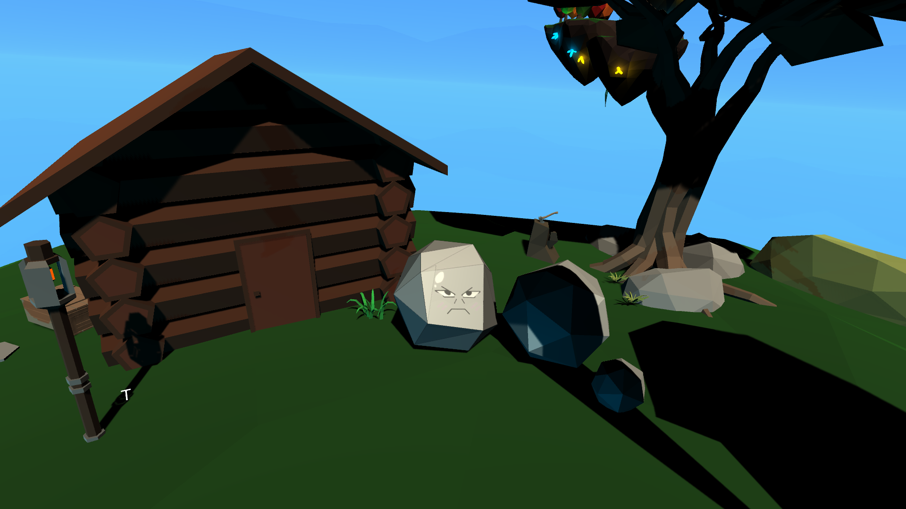
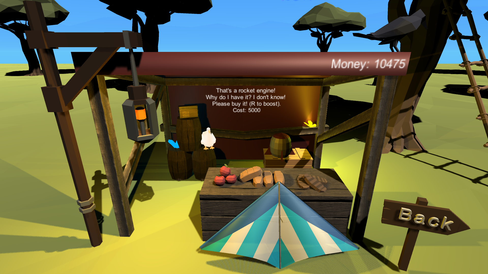
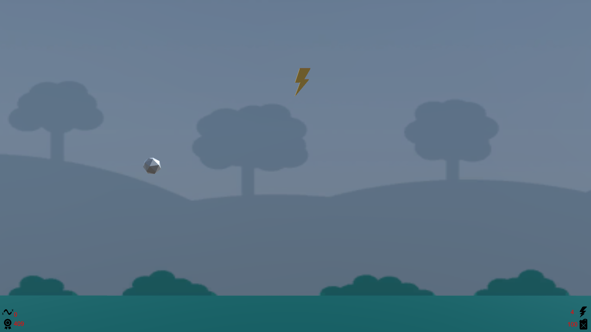
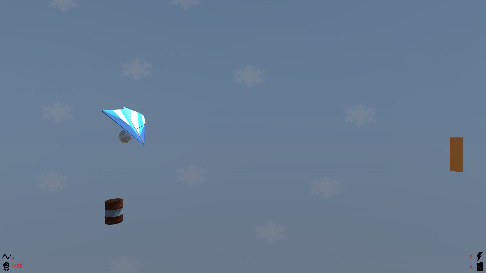

# Rock Ryder

Rock Ryder is a 2.5D endless runner action game  written with C# in Unity. 

The game contains 3 levels, an upgrade shop and narrative cutscenes.

### Contributors
* Gagan Heer
* Dylan Chew
* Kabilan Thangaranjah
* Renzo Pamplona.

### Game Scenes
#### Intro Cutscene

#### Upgrade Shop

#### First Level

#### Second Level with Glider Upgrade
